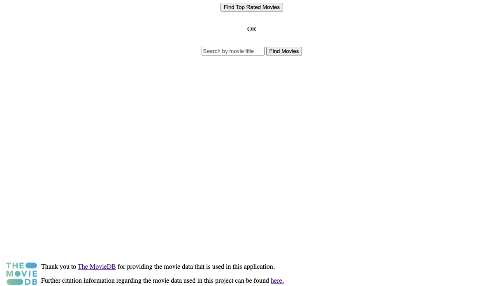
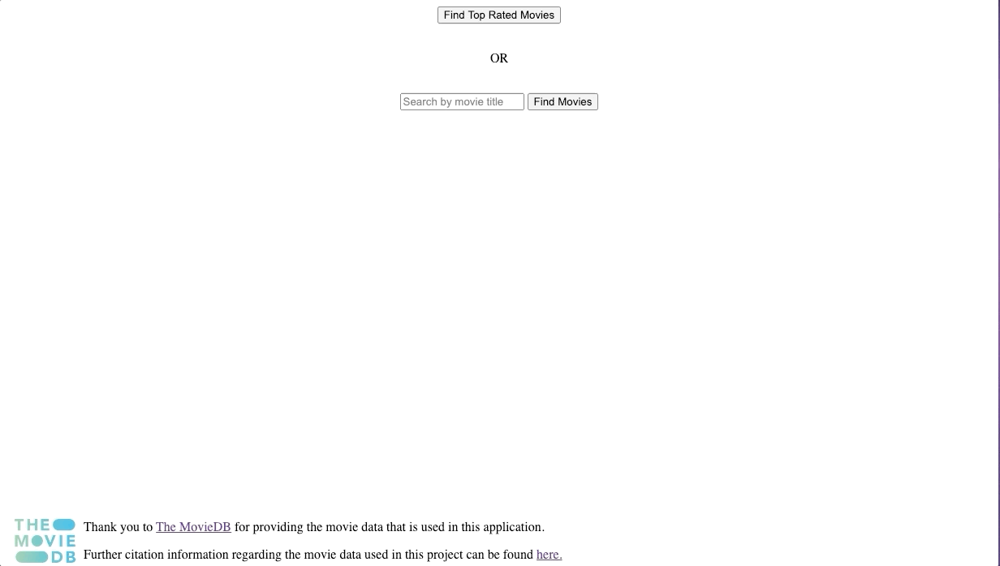
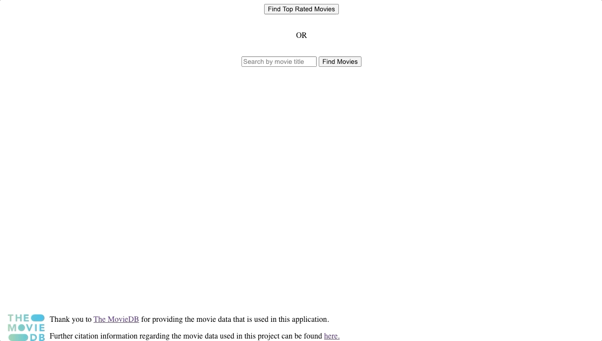

## YearOne API submission 

[Production Demo Here](https://yearone-api.herokuapp.com)  

[View my other repos on GitHub](https://github.com/NickEdwin)  
[View my LinkedIn](https://www.linkedin.com/in/nicholas-edwin/)  

# About this app

For this application I decided to give users not only the option to search for a movie, but also view top rated movies from The MovieDB. On a movies display page users can see a plethora of details for a movie including its: title, release date, rating, runtime, genre(s), cast, director, reviews, official trailer, and also reccomended similar movies. Visitors to the site also have the ability to vote on a movie by giving it a "👍" or "👎".  
I used SimpleCov to test my RSpec coverage (currently 100% coverage.) Travis CI was used for continuous integration and the application is live and usable on Heroku.  

## Demo Images   
Landing Page  
     
Top Rated Button   
      
Movie Search  
        
Movie Show Page  
        

## Local Setup

* Clone this repo by running the following commands in your terminal:  
    * `git clone git@github.com:nickedwin/yearone_api.git` (to clone the repo locally)  
    * `cd yearone_api` (to enter into the directory)  
    * `bundle install` (to install Ruby Gems)  
    * `rails db:reset` (to create database)  

## Database

Simple database storage which stores the movies name, its thumbs up, and thumbs down. This uses the activerecord method `.first_or_create` to allow the db to create an entry the first time a user votes on a movie. This allows the db to only store information on those which have votes and not get overloaded with API call results.  

## Languages / Frameworks / Tools 

  - Ruby 2.5.3  
  - Rails 5.2  
  - PostgreSQL  
  - RSpec  
  - Rubocop  
  - TravisCI  
  - SimpleCov  

## Known issues / next iteration  

Currently the app has a "Return Home" button which brings users back to the main page. The app also needs the implementation of a "Back" button that returns the user to the search results page they were last on. This would increase the user experience in my opinion.  
Styling could use some work, perhaps going over it with bootstrap to make it more visually appealing.   
Movies have the option in the code, but don't currently display any images or offficial posters, this would also increase the user experience to see them on the main display page.  
TravisCI was causing some issues as well, it would always pass deployment but not upload to Heroku, this may be an issue from their recent .org to .com transition that I'm missing somewhere.  
